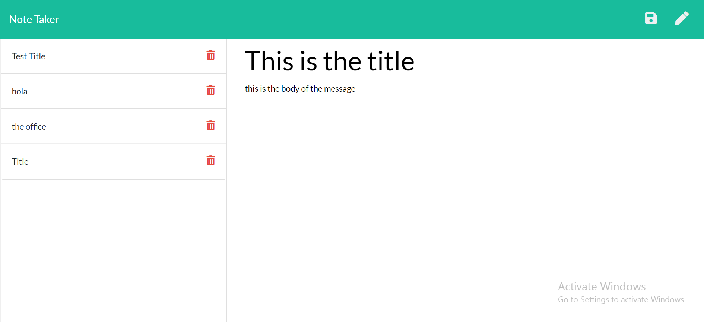

# Note Taker

## Description

This application provides the user with an online note taker. They are able to give their notes a title and type the rest of the message below. Then press "save" on the right hand side, and it will save the nore on the lefe-hand side of the screen. Previously saved notes will appear with only their title showing as a preview, and when no longer needed, the user can easily discard any unecessary note with the "delete" button.

 ## Installation

The Note Taker is deployed using [Heroku](https://ep-note-taker.herokuapp.com/), with the files used to create it within the [Github](https://github.com/Edibozu/note-taker-ep) repo, and can be easily cloned.
  
The image below shows the deployed app, alongwith a few notes, to show as examples.
  

   
This screenshot shows the prompts that appear when the application is ran. The user will answer predetermined questions about their employees, which will be saved and used to dynamically create a html file.
  

   
The html file will be inside the output folder, and can be opened and viewed in the browser. The user will find they insormation they entered organized and formatted for them to view.
  

  

## Questions

For any questions, contact me on any of the following links:

Email: edibozu@gmail.com

GitHub Repo: https://github.com/Edibozu/template-engine-employee-summary

LinkedIn: https://www.linkedin.com/in/eduardo-pineda-5595431b6/

## Contributions

This application was aided by my fellow classmates during our after class study sessions. 

## License

MIT License

Copyright (c) [2020] [Eduardo Pineda]

Permission is hereby granted, free of charge, to any person obtaining a copy
of this software and associated documentation files (the "Software"), to deal
in the Software without restriction, including without limitation the rights
to use, copy, modify, merge, publish, distribute, sublicense, and/or sell
copies of the Software, and to permit persons to whom the Software is
furnished to do so, subject to the following conditions:

The above copyright notice and this permission notice shall be included in all
copies or substantial portions of the Software.

THE SOFTWARE IS PROVIDED "AS IS", WITHOUT WARRANTY OF ANY KIND, EXPRESS OR
IMPLIED, INCLUDING BUT NOT LIMITED TO THE WARRANTIES OF MERCHANTABILITY,
FITNESS FOR A PARTICULAR PURPOSE AND NONINFRINGEMENT. IN NO EVENT SHALL THE
AUTHORS OR COPYRIGHT HOLDERS BE LIABLE FOR ANY CLAIM, DAMAGES OR OTHER
LIABILITY, WHETHER IN AN ACTION OF CONTRACT, TORT OR OTHERWISE, ARISING FROM,
OUT OF OR IN CONNECTION WITH THE SOFTWARE OR THE USE OR OTHER DEALINGS IN THE
SOFTWARE.
